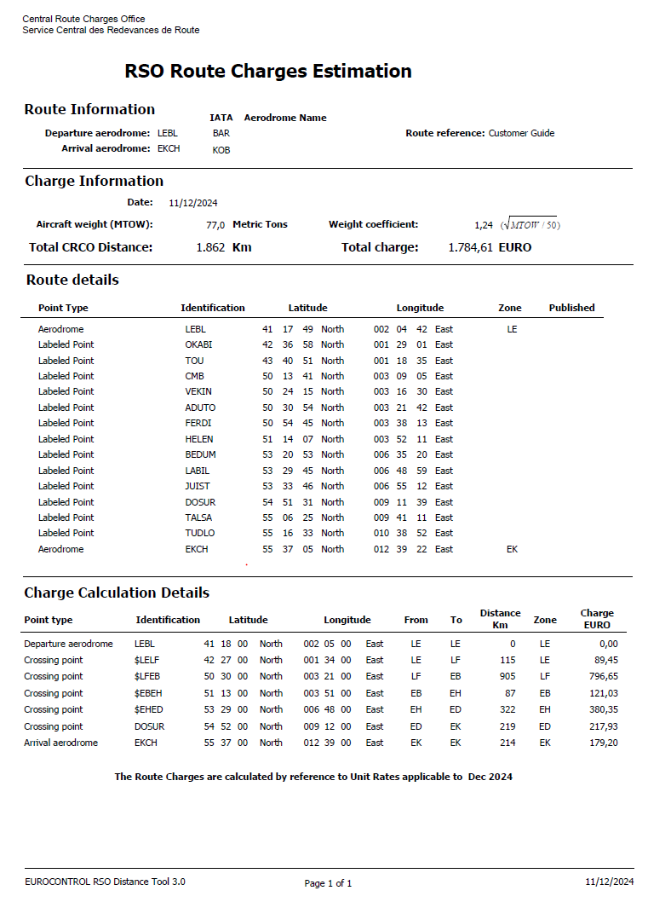
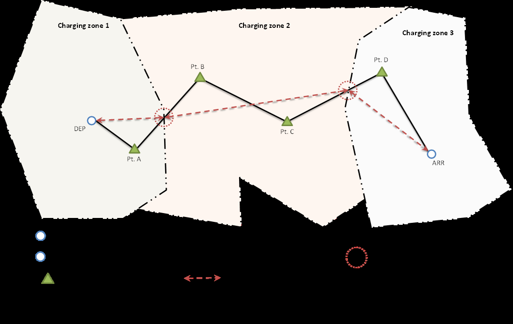

## Annex A. EUROCONTROL Route Charge Calculation Example

This section provides a concrete calculation example for a flight overflown across multiple charging zones.

### Flight Profile

*   **Flight Connection**: LEBL (Barcelona BCN) $\rightarrow$ EKCH (Copenhagen CPH)
*   **Aircraft MTOW**: 77.0 metric tonnes
*   **Flight Date**: 11 December 2024

### Route Description (ICAO FPL Field 15)

```text
LEBL SIDOKABI UN861 FISTO UY156 ADABI UN858 VANAD UN874 VEKIN UN873 ADUTO/N0450F350 
UN873 HELEN/N0448F360 UN873 SPY/N0448F350 UN873 GRONY/N0445F370 UN873 JUIST UP729 
BATOB/N0439F390 UP729 DOSUR P729 TUDLO STAR EKCH
```

### Full Point Profile (Nav Aids, Waypoints)

```text
OKABI TOU FISTO PERIG FOUCO ADABI BOKNO DEVRO VANAD VADOM BAMES KOPOR MTD NURMO 
PERON CMB VEKIN ADUTO FERDI HELEN TOLEN STD EKROS SPY BETUS ANDIK KEKIX GRONY 
BEDUM LABIL JUIST DHE BATOB DOSUR TALSA TUDLO
```

Based on this routing, the following distances are established in the charging zones concerned:

*   **Spain (LE)**: 115 km $\rightarrow$ **Distance Factor**: 1.15
*   **France (LF)**: 905 km $\rightarrow$ **Distance Factor**: 9.05
*   **Belgium (EB)**: 87 km $\rightarrow$ **Distance Factor**: 0.87
*   **Netherlands (EH)**: 322 km $\rightarrow$ **Distance Factor**: 3.22
*   **Germany (ED)**: 219 km $\rightarrow$ **Distance Factor**: 2.19
*   **Denmark (EK)**: 214 km $\rightarrow$ **Distance Factor**: 2.14

### Weight Factor Calculation

Taking the highest certificated MTOW of 77.0 metric tonnes, the weight factor is:
$$\text{Weight Factor} = \sqrt{\frac{77.0}{50}} = \sqrt{1.54} \approx 1.24$$

### Charge Calculation (December 2024 Tariffs)

The table below summarizes the calculation steps per charging zone overflown:

| State | Distance Factor | | Weight Factor | | Unit Rate (EUR) | | Charge (EUR) |
|---|:---:|:---:|:---:|:---:|:---:|:---:|:---:|
| **Spain (LE)** | 1.15 | $\times$ | 1.24 | $\times$ | 62.73 | $=$ | 89.45 |
| **France (LF)** | 9.05 | $\times$ | 1.24 | $\times$ | 70.99 | $=$ | 796.65 |
| **Belgium (EB)** | 0.87 | $\times$ | 1.24 | $\times$ | 112.19 | $=$ | 121.03 |
| **Netherlands (EH)** | 3.22 | $\times$ | 1.24 | $\times$ | 95.26 | $=$ | 380.35 |
| **Germany (ED)** | 2.19 | $\times$ | 1.24 | $\times$ | 80.25 | $=$ | 217.93 |
| **Denmark (EK)** | 2.14 | $\times$ | 1.24 | $\times$ | 67.53 | $=$ | 179.20 |
| **Total** | | | | | | $=$ | **1,784.61** |

---

## Annex B. RSO Route Charges Estimation

The printout below is generated by the **Route per State Overflown (RSO) Distance Tool** for the calculation described in Annex A. It shows detailed crossing points, coordinates, and exact zone charge values.

{.lightbox .border .shadow-sm}

---

## Annex C. Establishing the Distance Factor for International Flights

The diagram below illustrates how flight plan routes are divided into segments to establish the distance factors.

{.lightbox .border .shadow-sm}

### Legend:

::: {.legend-grid}

::: {.legend-item}
<div class="legend-icon" style="border: 2px solid #3b82f6; border-radius: 50%; width: 16px; height: 16px; margin: 0 auto; background: white;"></div>
<span>**DEP\*** = Departure aerodrome</span>
:::

::: {.legend-item}
<div class="legend-icon" style="border: 2px solid #3b82f6; border-radius: 50%; width: 16px; height: 16px; margin: 0 auto; background: white;"></div>
<span>**ARR\*** = Arrival aerodrome</span>
:::

::: {.legend-item}
<div class="legend-icon" style="width: 0; height: 0; border-left: 8px solid transparent; border-right: 8px solid transparent; border-bottom: 14px solid #16a34a; margin: 0 auto;"></div>
<span>**ATC Points**</span>
:::

::: {.legend-item}
<div class="legend-icon" style="border-bottom: 3px solid black; width: 32px; height: 8px; margin: 0 auto;"></div>
<span>**Flight Plan Route**</span>
:::

::: {.legend-item}
<div class="legend-icon" style="border-bottom: 2px dashed #475569; width: 32px; height: 8px; margin: 0 auto;"></div>
<span>**Charging Zone Boundary**</span>
:::

::: {.legend-item}
<div class="legend-icon" style="border-bottom: 2px dashed #dc2626; width: 32px; height: 8px; position: relative; margin: 0 auto;">
  <span style="position: absolute; right: 0; top: 0.5px; width: 0; height: 0; border-top: 3px solid transparent; border-bottom: 3px solid transparent; border-left: 5px solid #dc2626;"></span>
</div>
<span>**Great Circle Distance**</span>
:::

::: {.legend-item}
<div class="legend-icon" style="border: 2px dotted #dc2626; border-radius: 50%; width: 18px; height: 18px; margin: 0 auto;"></div>
<span>**Calculated Crossing Point** (on boundary)</span>
:::

:::

<div style="font-size: 0.85rem; color: #64748b; margin-top: 1rem; font-style: italic;">
* Note: For each take-off and for each landing in a charging zone, 20 km are deducted from the total distance for that charging zone.
</div>
